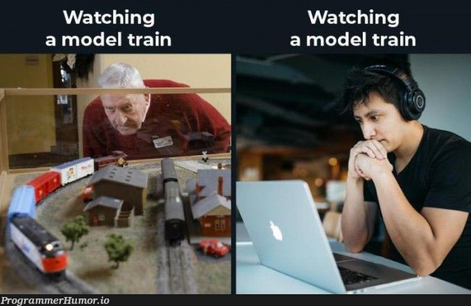

<div align="center">


</div>

```
╔══════════════════════════════════════════════════════════════╗
║   B. SARATH KUMAR                                              ║
║   AI/ML Engineering Student · AITS Tirupati · Class of 2028    ║
║   [ONLINE] — currently shipping MantraHaptics                  ║
╚══════════════════════════════════════════════════════════════╝
```

<div align="center">

[](https://www.linkedin.com/in/sarathakumarm3001/)
[](https://www.instagram.com/malpsbt3012/)
[](mailto:bhasasarathkumar051@gmail.com)
[](https://sarathkumarbhasa.github.io/Portfolio/)


</div>

---

### `$ cat philosophy.txt`

> Most people either grind fundamentals forever and never ship, or lean entirely on AI and never understand what they built. I do neither. **Learn it properly, then use AI to build it faster — not to skip understanding it.** Idea to working demo in days, not semesters.

```diff
+ Building LLM-powered apps, agents & automation with Python
+ Rapid prototyping — concept to working demo in days
+ Hardware + software — currently deep in embedded systems (ESP32, haptics)
+ Hackathon Finalist — Anantapur Police Hackathon 2026 & Women Ideathon 1.0
+ Open to AI/ML internships & collabs with people who actually ship
- Sleep schedule during hackathon week
```

<div align="center">


<sub>me watching the model train while the hackathon deadline gets closer</sub>
</div>

---

### `$ ls -la ./featured-builds/`

<br>

**`MantraHaptics/`** — vibroacoustic wellness wearable · MSME Idea Hackathon 6.0
Hybrid standalone/BLE haptic device built to compete directly with Sensate — four inbuilt modes as the core differentiator instead of requiring a phone tether.
`ESP32-S3` `DRV2605L` `LRA Haptics` `MAX98357A` `FreeRTOS`

<br>

**`FactoryPilot-AI/`** — IoT + AI shop-floor monitoring for Indian MSMEs
Full PRD with a three-tier fault-tolerant pipeline — deterministic rules catch the obvious faults, local statistical ML catches the subtle ones, cloud LLM is optional, never a dependency.
`IoT` `Python` `Statistical ML` `LLM (optional tier)`

<br>

**`FraudShield/`** — forensic fraud investigation platform · Anantapur Police Hackathon 2026 Finalist
Built for law enforcement, not just a demo — includes a post-fraud recovery layer with laundering-typology tagging, bank cooperation scoring, and PMLA-compliant STR generation.
`FastAPI` `MongoDB` `NetworkX` `React`

<br>

**`Sakhi/`** — WhatsApp-based women's health AI companion · Women Ideathon 1.0 Finalist
Built for real access, not app-store friction — meets users where they already are, on WhatsApp, with location-aware health guidance.
`FastAPI` `MongoDB` `OpenRouter/Llama` `OSM APIs`

<br>

**`MACHA.AI/`** — privacy-first Chrome extension for local LLMs
Runs entirely on-device through Ollama — no data leaves the browser. Includes YouTube transcript extraction and a side-panel chat, scoped first at medical/STEM students as the fastest-to-validate niche.
`Manifest V3` `Preact` `Vite` `Ollama`

---

### `$ ./run_diagnostics.sh --stats`

<div align="center">


</div>

---

### `$ cat achievements.log`

```
[2026] Anantapur Police Hackathon  ............... FINALIST
[2026] Women Ideathon 1.0          ............... FINALIST
[2026] MSME Idea Hackathon 6.0     ............... SUBMITTED — MantraHaptics
[2025] AAVEG25                     ............... CERTIFIED
[2025] Programming Foundations     ............... CERTIFIED
```

---

### `$ ./contribution_graph.sh`

<div align="center">

</div>

---

<div align="center">

**[ SYSTEM READY ]** — not chasing polish for its own sake. Every build here solves something real, for someone real.

*"Building real-world solutions from creative ideas."*

</div>
